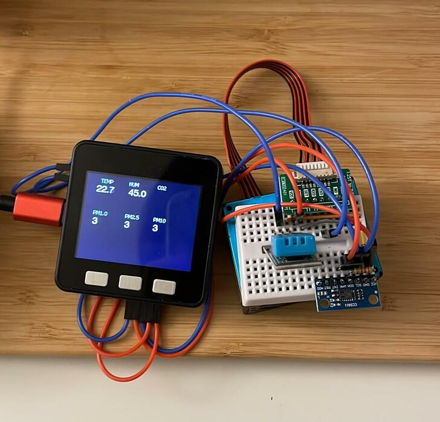

# Indoor Air Quality Monitor
From random hardware I have lying around at home. I don't have wifi at home but I might add logging on the M5 stack's SD card

## Hardware
* M5 stack core
* DHT11 temp/hum sensor
* CCS811 VOC and eCO2 sensor
* PM25AQI PM2.5 sensor

